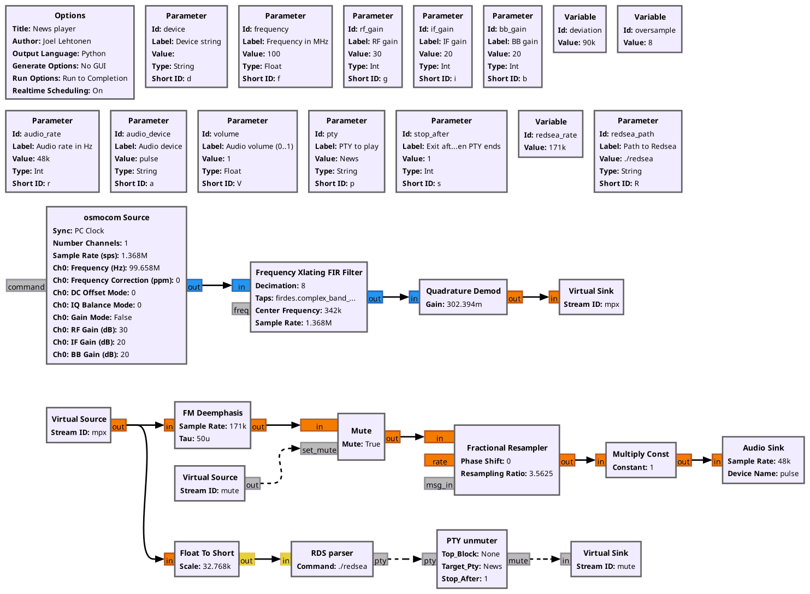

# labiuutiset

Plays only given program type from FM radio.

This tool plays only given programs of given FM station using any
Osmocom compatible SDR receiver. It is developed to play news
broadcast on
[YLE Radio Suomi](https://en.wikipedia.org/wiki/Yle_Radio_Suomi)
at Hacklab Jyväskylä, but any other station and program type will do.



## Requirements

* [GNU Radio](https://www.gnuradio.org/)
* [Gnuradio blocks from the OsmoSDR project](https://osmocom.org/projects/gr-osmosdr/wiki)
* [Redsea RDS Decoder](https://github.com/windytan/redsea) by windytan

## Installation

Install GNU Radio and OsmoSDR blocks and dependencies of Redsea. On
Debian or Ubuntu, just:

```sh
sudo apt install gnuradio gr-osmosdr git build-essential autoconf libsndfile1-dev libliquid-dev
```

Clone and build Redsea:

```sh
git clone https://github.com/windytan/redsea.git
cd redsea
./autogen.sh
./configure
make
```

Get back to the directory where labiuutiset is and compile the GNU
radio block:

```sh
grcc news_player.grc
```

Then, just set station frequency (`-f`) with the frequency (it
megahertz) and give your location of Redsea
binary to after `-R` parameter and run:

```
./news_player.py -f 99.3 -R /PATH/TO/redsea/src/redsea
```

See `./news_player.py --help` for all options such as gain and PTY.

## License

This work is licenced under the GNU General Public License version 3 or later (GPLv3).
